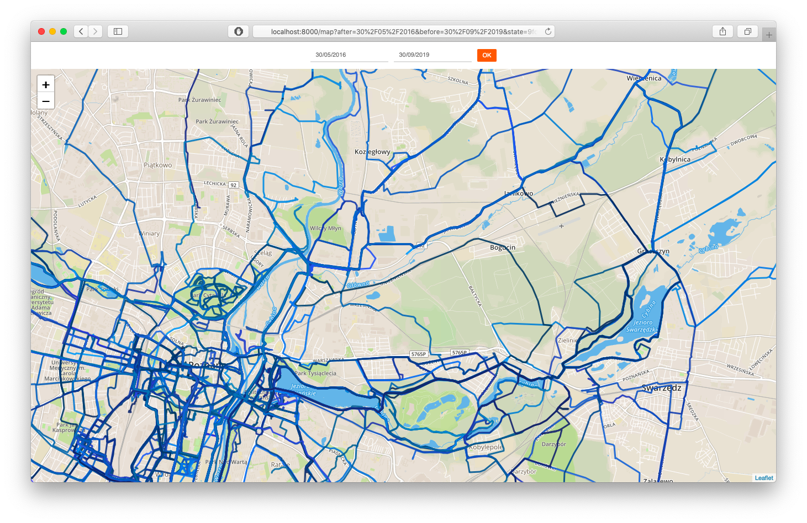

# plotted
Plots your Strava activities on a map.



## Why?
I wanted to have a tool that will plot all my routes from given period on a single map. It's just fun to watch it. Also it gives me information what is still to explore! 

## Prerequisities
1. Account on https://www.strava.com account with trainings to plot, and application created on the https://www.strava.com/settings/api.
2. Account on https://www.mapbox.com
3. Access tokens from abovementioned websites.
4. At least Go 1.11 installed

## Run application locally
1. Clone this repository outside your GOPATH, and `cd` into it.
2. Build application
```
make build
```
3. Run
```
FILE_STORAGE_PATH=./store NODE_ENV=dev MAPBOX_TOKEN={YOUR_MAPBOX_TOKEN} STRAVA_SECRET={YOUR_STRAVA_SECRET} STRAVA_CLIENT_ID={YOUR_STRAVA_CLIENT_ID} PORT=8000 ./bin/plotted
```
## Use with Google App Engine
### Prerequisities for using this app with Google App Engine
1. Create account on Google Cloud
2. Create a project in Google Cloud (save your project ID)
3. Create private key in a json format for Google Service Account for your project. Download the file to your machine.
4. Install Google Cloud SDK on your machine

### Run locally using Google App Engine development server
1. Copy template with environment variables
```
cp env_variables.yml.tmpl cmd/plotted/env_variables.yml
```
2. Fill all variables in the `cmd/plotted/env_variables.yml`. Note that `NODE_ENV` needs to be set to `production` and `GOOGLE_CREDENTIALS` needs to point to your json key file.
3. Go to the directory
```
cd cmd/plotted
```
4. Run
```
dev_appserver.py app.yaml  --automatic_restart=False --application={YOUR_PROJECT_ID}
```
Note: you can setting `NODE_ENV` to `production` means that local application will use your Google data store for caching. If you want to use local store for caching set `NODE_ENV` to `dev`. And add `FILE_STORAGE_PATH` which will provide path for directory of your choice.
### Deploy to the the cloud
1. Copy template with environment variables
```
cp env_variables.yml.tmpl cmd/plotted/env_variables.yml
```
1. Fill all variables in the `cmd/plotted/env_variables.yml`. Note that `NODE_ENV` needs to be set to `production`.
2. Go to the directory
```
cd cmd/plotted
```
4. Run
```
gcloud app deploy
```
